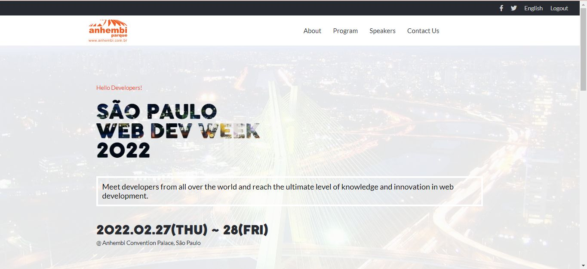

# webdevweek
1st Dev Week - Capstone Project Week 1

> Module 1, Week 5 - 1st Capstone Project
> Continuing work for Microverse Program - Capstone Project for Module 1 on Microverse Program - Week 5

# Images & Video

## Images

## Video

https://www.loom.com/share/31b53550cc1d4161bcee5abc6a1872a8

  

## Built With

- HTML
- CSS
- Webhint
- Stylelint
- ESlint

## Getting Started

To get a local copy up and running follow these simple example steps.

### Pre-requisites

- Knowledge on basic html and css
- Text Editor (VScode, Atom, Sublime text, etc)
- Basic knowledge of node.js

### Setup

- clone repository using `git clone`
- run `npm install`
- run `live server`

### Github page for this project

- https://fernando-silvabr66.github.io/webdevweek/

## Authors

👤 **Author**

- GitHub: [@fernando-silvabr66](https://github.com/fernando-silvabr66)
- Twitter: [@fsilvabr1](https://twitter.com/fsilvabr1)
- LinkedIn: [https://linkedin.com/in/fernando-silvabr66](https://linkedin.com/in/fernando-silvabr66)

## Show your support

Give a ⭐️ if you like this project!

## Acknowledgments

- Hat tip to anyone whose code was used
- Inspiration
- etc

## 📝 License

This project is [MIT](./MIT.md) licensed.

